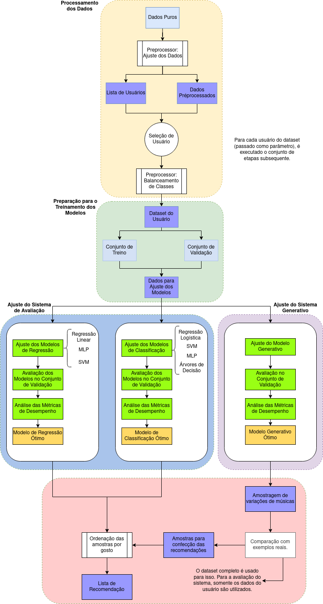

# Projeto - Aprendizado de Máquina - 3Q21

Projeto Final da disciplina Aprendizado de Máquina do 3º quad de 2021 da UFABC.

### Organização dos Arquivos.

A pasta _Scripts_ contém os módulos das principais funções e classes utilizadas na implementação do sistema. O módulo _"data_processing"_ possui o código relativo ao pré-processamento e manipulação dos dados; o módulo _"model_analysis"_ contém o código para análise automática de múltiplos modelos de aprendizado de máquina; por fim, o módulo _"models"_ contém as classes dos modelos que compõem o sistema de recomendação, e as funções necessárias para o seu treinamento e uso.

O notebook _"Análise Exploratória"_ contém o código executado para realizar a análise apresentada na Etapa 2 do projeto, e no notebook _"Avaliação de Modelos"_ estão disponíveis o código e os outputs do treinamento e avaliação dos modelos, análise essa apresentada na Etapa 5 do projeto. A criação e teste do sistema de recomendação completo está disponível no notebook _"Sistema Completo"_.

Na pasta _backup_ estão disponíveis outros notebooks utilizados para o estudo de certas estruturas e análises auxiliares, guardadas para fins de registro.

### Dependências

__Para fazer: criar um arquivo .yml ou equivalente para instalação automática das dependências.__

Fora os módulos tradicionais para Aprendizado de Máquina disponíveis pelo pacote Conda, o sistema generativo foi implementado utilizando os pacotes PyTorch e Skorch. A execução do código foi ajustada para funcionar com ou sem a disponibilidade de uma GPU com CUDA.

### Diagrama Esquemático do Sistema de Recomendação

